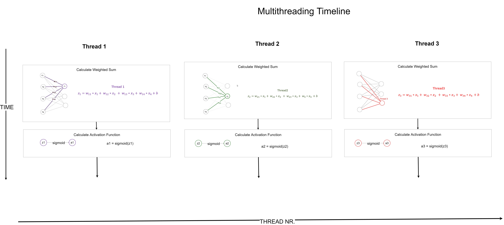

## Linear Layer

Last time we assumed a given **z value** in order to be able to compute the activation function.
This time we are actually going to compute the **z value** , also known as weighted sum.
In neural networks the thing which computes the weighted sum is the **Linear Layer**.

The first thing we need before we start is a plan on how we should exploit the many threads we can use.
So we need to come up with a scheme on how to distribute the work among the threads.

We are going to use the follwoing idea:

One thread takes care of one neuron. So if we have 3 output neurons we are going to use 3 threads.
Each of this thread uses the weights which belongs to it's assigned output neuron and calculates the weighted sum and then calculates the activation value.



For the cuda kernel we need the following **input information**
1. The values of the weights
2. The values of the biases
3. The values of the inputs
4. The number of input neurons
5. The number of output neurons

And we need to calculate the **follwoing quantites**
1. z_values
2. activation_values


```
__global__ void linear_layer_and_activation(float *weight_matrix, float *biases, float *x_inputs, 
	                                    float *z_values, float *activation_values, 
					    int nr_output_neurons, int nr_input_neurons)
{
        // We use the thread id so we can index different weights/neurons in each thread
	int id = threadIdx.x;

	// w*x
	// We loop over every incoming neuron and multiply it with it's weight and sum it to the current z_value
	for (int neuron_nr = 0; neuron_nr < nr_input_neurons; neuron_nr++)
	{
		z_values[id] += weight_matrix[(nr_input_neurons)* id + neuron_nr] * x_inputs[neuron_nr];
	}

	// w*x + b
	// Don't forget to add the bias
	z_values[id] += biases[id];

	// The we compute the activation value just like in part1 of the tutorial
	// sig(w*x + b)
	activation_values[id] = 1.0 / (1.0 + exp(-z_values[id]));
	
}
```
