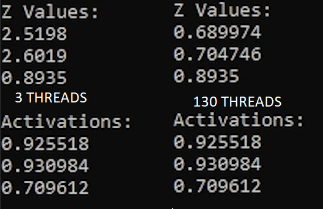
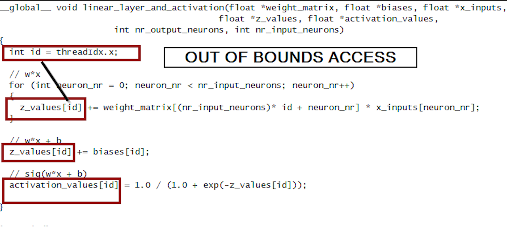
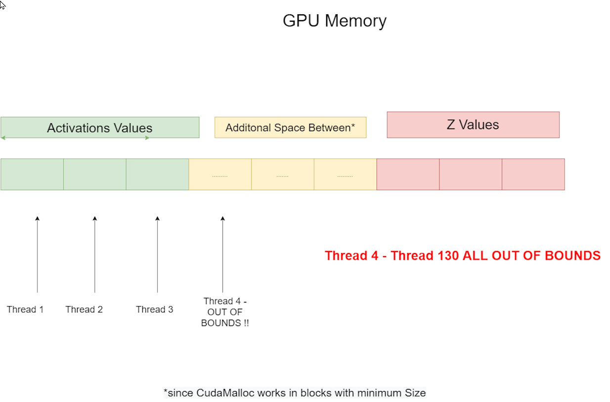

# Multiple Layers - WARNING THIS IS A WORK IN PROGRESS

## 1. Review - Previous Video Bugs 

In Part 2 we glossed over a bug to keep it short and simple. However we need to understand and fix this bug, because we need it for multiple layers.
When we call a Cuda Kernel we can decide on how many cuda threads the kernel should run. Last time I ran the kernel with 3 Threads. Remeber that neural network had 4 Input Neurons, and 3 Output Neurons. But what happens when we run it with more threads than needed ? 

For example 130 threads instead:

So we replace this:

```c
linear_layer_and_activation << <OUTPUT_NEURONS / 256 + 1, OUTPUT_NEURONS >> > (d_weights, d_biases, d_inputs, d_z, d_activations, OUTPUT_NEURONS, INPUT_NEURONS);
```

with that:

```c
linear_layer_and_activation << <1, 130 >> > (d_weights, d_biases, d_inputs, d_z, d_activations, OUTPUT_NEURONS, INPUT_NEURONS);
```


we run the kernel again and compare the results:



Here we can see that we get the wrong results when we use more threads than necessary. Why does this happen ? 

Maybe you can figure it out while having a look at the kernel ? (Don't scroll too far if you don't want to know the answer !)

```c
__global__ void linear_layer_and_activation(float *weight_matrix, float *biases, float *x_inputs, 
	                                        float *z_values, float *activation_values, 
											int nr_output_neurons, int nr_input_neurons)
{
	int id = threadIdx.x;

	// w*x
	for (int neuron_nr = 0; neuron_nr < nr_input_neurons; neuron_nr++)
	{
		z_values[id] += weight_matrix[(nr_input_neurons)* id + neuron_nr] * x_inputs[neuron_nr];
	}

	// w*x + b
	z_values[id] += biases[id];

	// sig(w*x + b)
	activation_values[id] = 1.0 / (1.0 + exp(-z_values[id]));
	
}
```

So the reason why this happens is due to out ouf bounds access. Since we have to use the thread_id as our indexing method, this can lead to problems if we have more threads than we have elements in the arrays. 



How do we solve it ? We use something called a MemoryGuard ! We basically just put a if statement and check if the thread_index is lower or equal than the array size (in our case the nr of output neurons), and only then execute code. Otherwise we don't do anything. Therefore avoid "undefined behaviour" . 

Usually I don't like the term undefined behaviour since most of the time one can actually figure out what will happen. So that's why I'm also going to explain it in detail how we got this messed up z_values !

### The bug under the hood 

So you may have wondered why I choose to run the cuda kernel with 130 threads. Seem pretty arbitrary doesn't it ? Well the reason for that is the memory layout on the GPU.



So remember we call `cudaMalloc(&d_activations, bytes_activations);` where bytes_activations is 12 bytes (if i did the math in my head correctly). But what actually happens is not that we get the 12 bytes we reserved. But instead we get 512 bytes. Because that's the minimum chunk size which cudaMalloc uses ! 
This has the side effect that the memory address of **d_z** is 512 bytes away from **d_activations**. So if I had only used 100 Threads I couldn't have shown the bug to you. So we need at least 129 threads to start overriding z_values ! 

128 * 4 (number of bytes for floating point) = 512 

So Thread Nr. 129 will overwrite z_values[0] (because actvation_values[129] == z_values[0])
And Thread Nr. 130 will overwrite z_values[1] (because actvation_values[130] == z_values[1])

And Thread Nr. 131 ..... would override z_values[2] but we don't have a thread 131. This is the reason why only 2 out of 3 z_values are wrong.

Have another look at the image above to confirm this. 


### The solution 

Now the solution is actually pretty simple we just add the following line around the entire code:

```c
if (id < nr_output_neurons)
```

So why did I go through so much trouble to explain all of this ? 

The reason is that when we have a neural network with many layers, each layer might have different amount of neurons and therefore might only need a specific amount of threads. So we need a way to protect ourselves from Out of Bounds access if the number of neurons aren't the same across all layers.


```c
__global__ void linear_layer_and_activation(float *weight_matrix, float *biases, float *x_inputs, 
	                                    float *z_values, float *activation_values, 
					    int nr_output_neurons, int nr_input_neurons)
{
	int id = threadIdx.x;

	// Define offset for the current layer
	int layer_offset_z_b = 0;
	int layer_offset_weights = 0;
	int layer_offset_activations = 0;
	
	for (int shape_index = 0; shape_index < shape_length; shape_index++)
	{
		// Other threads don't execute anything to avoid out of bounds access
		if (id < shape[shape_index + 1])
		{
			int nr_inputs_to_this_layer = shape[shape_index];
			// w*x
			for (int neuron_nr = 0; neuron_nr < nr_inputs_to_this_layer; neuron_nr++)
			{
				z_values[layer_offset_z_b + id] += weight_matrix[layer_offset_weights + (nr_inputs_to_this_layer)* id + neuron_nr] *
					activation_values[layer_offset_activations + neuron_nr];
			}

			// w*x + b
			z_values[layer_offset_z_b + id] += biases[layer_offset_z_b + id];

			// sig(w*x + b)	
			// 		                        + shape[shape_index] => write activation values for next layer,
			//                                                      instead of overwriting the input values
			activation_values[layer_offset_activations + shape[shape_index] + id] = 1.0 / (1.0 + exp(-z_values[layer_offset_z_b + id]));
		}

		// Important to do this outside the Memory Guard 
		layer_offset_weights += shape[shape_index] * shape[shape_index + 1];
		layer_offset_z_b += shape[shape_index + 1];
		layer_offset_activations += shape[shape_index];

		// Call syncthreads so we know that all threads have finished working on the current layerbefore we take care of the next layer
		// Try removing this and guess what will happen.
		__syncthreads();
	
}
```


## Defining the shape


1. We need one buffer on the CPU for the z values 
2. And one for the activation values. 

We will call this host_z_values and host_activations. In the cuda world it’s convention to designate data which is stored on **cpu** accessible memory with **host**. And data which is stored on **GPU** accessible memory with **device**. 

```c
int main()
{
  const int INPUT_NEURONS = 4;
	const int OUTPUT_NEURONS = 3;

	// Initialize weights on CPU/RAM
	const int size_w = INPUT_NEURONS * OUTPUT_NEURONS;
	float *host_weights = new float [size_w] {0.80f, 0.87f, 0.16f, 0.96f, 0.89f, 0.87f, 0.31f, 0.08f, 0.09f, 0.69f, 0.03f, 0.42f};

	// Initialize biases on CPU/RAM
	const int size_b = OUTPUT_NEURONS;
	float *host_biases = new float [size_b] {0.68f, 0.83f, 0.01f};
	float host_input[INPUT_NEURONS] = { 0.75f,0.98f,0.74f,0.28f };

	// Initialize activations on CPU/RAM
	float *host_activations = new float [size_b] {0.0, 0.0, 0.0};

	// Initialize z Matrix
	float *host_z = new float [size_b] {0.0, 0.0, 0.0};
}
```


## 2. Request GPU Memory for the shape 

First we calculate the numbers of bytes needed because we are going to need this for the cudaMalloc call.


## 4. Launching the Kernel - Changing the paraemters

Alright that’s all the code we need for the kernel. We now have a kernel which can compute all the z values and activations. The only thing left to do now is to call the kernel. This can be done via the triple chevron launch syntax. 

```c
// Call the kernel which calculates the activations.
// Call cuda kernel
linear_layer_and_activation << <1 , nr_threads >> > (d_weights, d_biases, d_inputs, d_z, d_activations, d_shape, shape_length);
```


## 6. Print the results
```c

```

### [Full code](kernel.cu)
