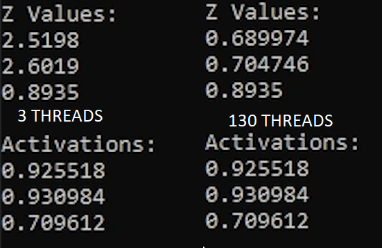
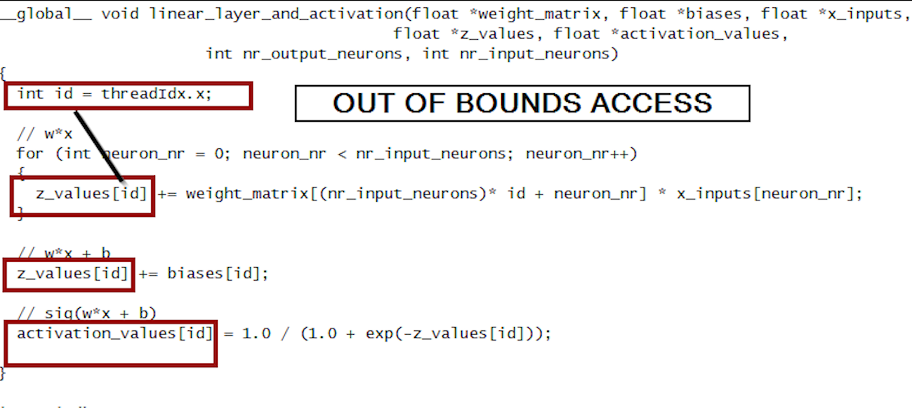
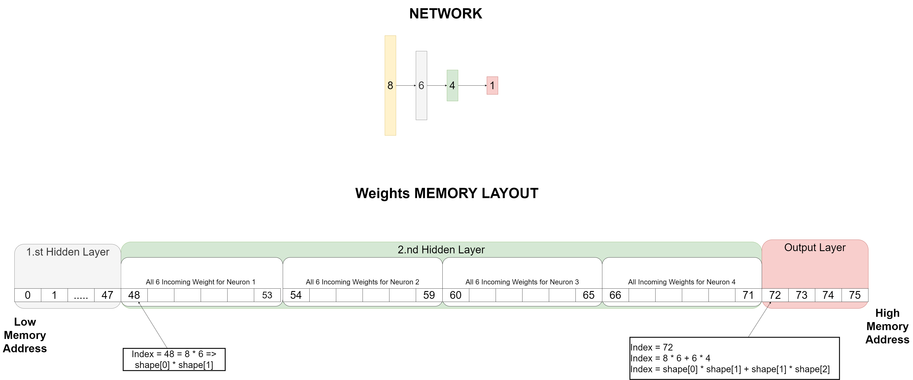
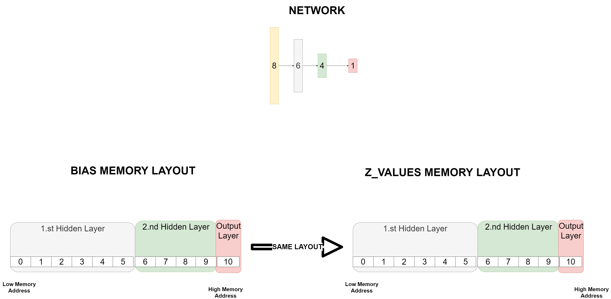
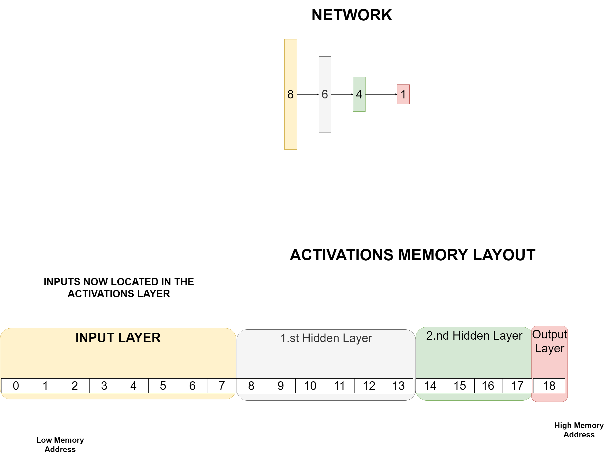

# Multiple Layers

In Part 3 we are going to make the changes needed so we can run a neural network with multiple layers.

What we did so far:
* Part 1 - Implement Cuda Kernel which can execute the sigmoid activation function for many values at once
* Part 2 - Add the Linear Layer (Dot Product) to our Kernel

So far we only had inputs and outputs but no hidden layers.

What we will do in this part:

* Part 3 - Change the kernel so we can feedforward through multiple layers.

## 1. Review - Previous Video Bugs 

In [Part 2](https://github.com/ThoenigAdrian/NeuralNetworksCudaTutorial/tree/main/Part%202%20-%20Linear%20Layer) we glossed over a bug to keep it short and simple. However we need to understand and fix this bug, because we need it for multiple layers.
When we call a Cuda Kernel we can decide on how many cuda threads the kernel should run. Last time I ran the kernel with 3 Threads. Remeber that neural network had 4 Input Neurons, and 3 Output Neurons. But what happens when we run it with more threads than needed ? 

For example 130 threads instead:

So we replace this:

```c
linear_layer_and_activation << <OUTPUT_NEURONS / 256 + 1, OUTPUT_NEURONS >> > (d_weights, d_biases, d_inputs, d_z, d_activations, OUTPUT_NEURONS, INPUT_NEURONS);
```

with that:

```c
linear_layer_and_activation << <1, 130 >> > (d_weights, d_biases, d_inputs, d_z, d_activations, OUTPUT_NEURONS, INPUT_NEURONS);
```

### 1.1 Bug Showcase
We run the kernel again and compare the results:



Here we can see that we get the wrong results when we use more threads than necessary. Why does this happen ? 

Maybe you can figure it out while having a look at the kernel ? (Don't scroll too far if you don't want to know the answer !)

```c
__global__ void linear_layer_and_activation(float *weight_matrix, float *biases, float *x_inputs, 
	                                        float *z_values, float *activation_values, 
											int nr_output_neurons, int nr_input_neurons)
{
	int id = threadIdx.x;

	// w*x
	for (int neuron_nr = 0; neuron_nr < nr_input_neurons; neuron_nr++)
	{
		z_values[id] += weight_matrix[(nr_input_neurons)* id + neuron_nr] * x_inputs[neuron_nr];
	}

	// w*x + b
	z_values[id] += biases[id];

	// sig(w*x + b)
	activation_values[id] = 1.0 / (1.0 + exp(-z_values[id]));
	
}
```
### 1.2 Bug Explanation
So the reason why this happens is due to out ouf bounds access. Since we have to use the thread_id as our indexing method, this can lead to problems if we have more threads than we have elements in the arrays. 



How do we solve it ? We use something called a MemoryGuard ! We basically just put a if statement around our code. We check if the thread_index is lower or equal than the array size (in our case the **nr of output neurons**), and only then execute code. Otherwise we don't do anything. Therefore avoiding "undefined behaviour" . 

Usually I don't like the term undefined behaviour since most of the time one can actually figure out what will happen. So that's why I'm also going to explain it in detail how we got this messed up z_values !

### 1.3 The Details

So you may have wondered why I choose to run the cuda kernel with 130 threads. Seems pretty arbitrary doesn't it ? Well the reason for that is the memory layout on the GPU.


So remember we call `cudaMalloc(&d_activations, bytes_activations);` where bytes_activations is 12 bytes (3 values * 4 bytes per float). But don't get the 12 bytes we requested, instead we get 512 bytes. Because that's the minimum chunk size which cudaMalloc uses ! 
This has the side effect that the memory address of **d_z** is 512 bytes away from **d_activations**. 
if I had only used 100 Threads I couldn't have shown the bug to you. So we need at least 129 threads to start overriding z_values ! 


128 * 4 (number of bytes for floating point) = 512 

Thread Nr. 129 will overwrite `z_values[0]` because `actvation_values[129]` and `z_values[0]` have the same memory address.

Thread Nr. 130 will overwrite `z_values[1]` because `actvation_values[130]` and `z_values[1]` have the same memory address.

Thread Nr. 131 ..... would override `z_values[2]` but we don't have a thread 131. This is the reason why only 2 out of 3 z_values are wrong.

## 2. The Memory Guard

Now the solution is called a Memory Guard. While it sounds fancy it's actually pretty simple.
We just add the following line around the entire code:

```c
if (id < nr_output_neurons) // id refers to the thread number
```
This makes sure we only compute activation_values when the thread can be mapped to a neuron. If there are more threads than neurons now , the other threads will just do nothing instead of overwriting other values.
```c
if (id < nr_output_neurons)
{
	// w*x
	for (int neuron_nr = 0; neuron_nr < nr_input_neurons; neuron_nr++)
	{
		z_values[id] += weight_matrix[(nr_input_neurons)* id + neuron_nr] * x_inputs[neuron_nr];
	}

	// w*x + b
	z_values[id] += biases[id];

	// sig(w*x + b)
	activation_values[id] = 1.0 / (1.0 + exp(-z_values[id]));
}
```

This are the results:


So why did I go through so much trouble to explain all of this ? 

The reason is that when we have a neural network with many layers, each layer might have different amount of neurons and therefore might only need a specific amount of threads. So we need a way to protect ourselves from Out of Bounds access if the number of neurons aren't the same across all layers.


## 3. Implementing Cuda Kernel with multiple Layers

Alright so next thing to do is to implement to CUDA Kernel so it can handle multiple layers.
First we are going to define a shape variable (integer array) which tells us the shape of the neural network.

For example: `shape = [8, 6, 4, 1]` would look like this.


We pass this shape to the cuda kernel as well as the shape_length so we know the length of the shape array.

```c
__global__ void linear_layer_and_activation(float *weight_matrix, float *biases,
	                                    float *z_values, float *activation_values, 
					    int *shape, int shape_length)
```

Now that we have done this we can loop over every layer with a for loop

```c
__global__ void linear_layer_and_activation(float *weight_matrix, float *biases, float *x_inputs, float *z_values, float *activation_values, 
					    int *shape, int shape_length)
	
{
	
	for (int shape_index = 0; shape_index < shape_length; shape_index++)
	{
		// calculate weighted sum
		// calculate activations
	}
}
```

In order to know how to implement the inner part of the loop we first need to decide on how we want to store the weights, activations, biases, and z_values for multiple layers.

### 3.1 Memory Layout

We are going to use the following memory Layout

**Weights**

This is the layout for the weights. 


**Biases Z values**


This is the layout for the biases. Coincidentally this is also the layout for the z_values. Because the number of biases matches the number of z_values. 



**Activations**


One big change we are going to make here is we are also going to store the inputs in the activations. So we can get rid of x_inputs in the function signature.




```c
__global__ void linear_layer_and_activation(float *weight_matrix, float *biases, float *x_inputs, 
	                                    float *z_values, float *activation_values, 
					    int nr_output_neurons, int nr_input_neurons)
{
	int id = threadIdx.x;

	// Define offset for the current layer
	int layer_offset_z_b = 0;
	int layer_offset_weights = 0;
	int layer_offset_activations = 0;
	
	for (int shape_index = 0; shape_index < shape_length; shape_index++)
	{
		// Other threads don't execute anything to avoid out of bounds access
		if (id < shape[shape_index + 1])
		{
			int nr_inputs_to_this_layer = shape[shape_index];
			// w*x
			for (int neuron_nr = 0; neuron_nr < nr_inputs_to_this_layer; neuron_nr++)
			{
				z_values[layer_offset_z_b + id] += weight_matrix[layer_offset_weights + (nr_inputs_to_this_layer)* id + neuron_nr] *
					activation_values[layer_offset_activations + neuron_nr];
			}

			// w*x + b
			z_values[layer_offset_z_b + id] += biases[layer_offset_z_b + id];

			// sig(w*x + b)	
			// 		                        + shape[shape_index] => write activation values for next layer,
			//                                                      instead of overwriting the input values
			activation_values[layer_offset_activations + shape[shape_index] + id] = 1.0 / (1.0 + exp(-z_values[layer_offset_z_b + id]));
		}

		// Important to do this outside the Memory Guard 
		layer_offset_weights += shape[shape_index] * shape[shape_index + 1];
		layer_offset_z_b += shape[shape_index + 1];
		layer_offset_activations += shape[shape_index];

		// Call syncthreads so we know that all threads have finished working on the current layerbefore we take care of the next layer
		// Try removing this and guess what will happen.
		__syncthreads();
	
}
```


## 4. Changing Main (Preparing for the Kernel Launch)


```c
int main()
{
  const int shape_length = 4;
  int shape[shape_length] = { 8, 6, 4, 1 };

}
```

Calculating the number of weights according to the shape.

```c
int nr_weights = 0;

for (int shape_index = 0; shape_index < shape_length - 1; shape_index++)
{
	nr_weights += shape[shape_index] * shape[shape_index + 1];
}
```


Calculating the number of neurons, number of biases and number of z_values.

```c
// Initialize biases on CPU/RAM
int nr_neurons = 0;
int nr_biases = 0;

for (int shape_index = 0; shape_index < shape_length; shape_index++)
{
	nr_neurons += shape[shape_index];
}

nr_biases = nr_neurons - shape[0];
float *host_biases = new float [nr_biases] {-0.31f, 0.83f, 0.23f, 0.76f, -0.22f, -0.20f, 0.19f, 0.41f, 0.20f, 0.12f, -0.67f};

// The first 8 values are our inputs rest of the array can be initialized with 0.0 
float *host_activations = new float [nr_neurons] {0.38f, 0.12f, 1.13f, 1.20f, 0.19f, -0.38f, -0.64f, 0.42f};

// Initialize z Matrix
float *host_z = new float [nr_biases] {0.0f};
```

## 4.1 Request GPU Memory for the shape

First we calculate the numbers of bytes needed because we are going to need this for the cudaMalloc call.
Now we also need to transfer the shape array to the GPU memory via cudaMalloc. And refactor the cuda a little bit

```c

// Calculate the amount of memory needed so we can provide this information to cuda malloc
const size_t bytes_biases = nr_biases * sizeof(float);
const size_t bytes_z = nr_biases * sizeof(float);
const size_t bytes_weights = nr_weights * sizeof(float);
const size_t bytes_activations = nr_neurons * sizeof(float);
const size_t bytes_shape = sizeof(int) * shape_length;


// Allocate GPU device memory
float *d_biases, *d_weights, *d_activations, *d_z;
int *d_shape;
cudaMalloc(&d_biases, bytes_biases);
cudaMalloc(&d_weights, bytes_weights);
cudaMalloc(&d_activations, bytes_activations);
cudaMalloc(&d_z, bytes_z);
cudaMalloc(&d_shape, bytes_shape);	

## 4.2 Copying data to the GPU

// Copy data from CPU Memory to GPU Memory
cudaMemcpy(d_biases, host_biases, bytes_biases, cudaMemcpyHostToDevice);
cudaMemcpy(d_weights, host_weights, bytes_weights, cudaMemcpyHostToDevice);
cudaMemcpy(d_activations, host_activations, bytes_activations, cudaMemcpyHostToDevice);
cudaMemcpy(d_z, host_z, bytes_z, cudaMemcpyHostToDevice);
cudaMemcpy(d_shape, shape, bytes_shape, cudaMemcpyHostToDevice);
```


## 5. Launching the Kernel - Changing the parameters

Alright that’s all the code we need for the kernel. We now have a kernel which can compute all the z values and activations. The only thing left to do now is to call the kernel. This can be done via the triple chevron launch syntax. 

```c
// Call the kernel which calculates the activations.
// Call cuda kernel
int nr_threads = *std::max_element(shape + 1, shape + shape_length);
linear_layer_and_activation << <1 , nr_threads >> > (d_weights, d_biases, d_inputs, d_z, d_activations, d_shape, shape_length);
```


## 6. Evaluating Results
```c
int z_offset = 0;
for (int shape_index = 1; shape_index < shape_length; shape_index++)
{
	std::cout << "Z Values " << shape_index << ". hidden layer" << std::endl;
	for (int neuron_nr = 0; neuron_nr < shape[shape_index]; neuron_nr++)
	{
		std::cout << host_z[neuron_nr + z_offset] << std::endl;
	}
	z_offset += shape[shape_index];
}

int activations_offset = shape[0]; // Skip input values	
for (int shape_index = 1; shape_index < shape_length; shape_index++)
{
	std::cout << "Activations " << shape_index << ". hidden layer" << std::endl;

	for (int neuron_nr = 0; neuron_nr < shape[shape_index]; neuron_nr++)
	{
		std::cout << host_activations[neuron_nr + activations_offset] << std::endl;
	}
	activations_offset += shape[shape_index];
}
```
```
Z Values 1. hidden layer
-2.044
-1.0022
-0.2072
-0.2223
-2.4051
1.8146
Z Values 2. hidden layer
-0.0462236
2.12385
0.516693
0.46798
Z Values 3. hidden layer
-0.847503
Activations 1. hidden layer
0.11466
0.268509
0.448385
0.444653
0.0827846
0.859917
Activations 2. hidden layer
0.488446
0.893199
0.626374
0.614905
Activations 3. hidden layer
0.299957
```

## 7. Verification

The results can be verfied with the follwoing python code:
```python
import numpy
import numpy as np

weights = numpy.array([1.62, -0.61, -0.53, -1.07, 0.87, -2.30, 1.74, -0.76, 0.32, -0.25, 1.46, -2.06, -0.32, -0.38, 1.13,
                       -1.10, -0.17, -0.88, 0.04, 0.58, -1.10, 1.14, 0.90, 0.50, 0.90, -0.68, -0.12, -0.94, -0.27, 0.53,
                       -0.69, -0.40, -0.69, -0.85, -0.67, -0.01, -1.12, 0.23, 1.66, 0.74, -0.19, -0.89, -0.75, 1.69, 0.05,
                       -0.64, 0.19, 2.10, 0.12, 0.62, 0.30, -0.35, -1.14, -0.35, -0.21, 0.59, 0.84, 0.93, 0.29, 0.89, -0.75,
                       1.25, 0.51, -0.30, 0.49, -0.08, 1.13, 1.52, 2.19, -1.40, -1.44, -0.50, 0.16, 0.88, 0.32, -2.02])
biases = numpy.array([-0.31, 0.83, 0.23, 0.76, -0.22, -0.20, 0.19, 0.41, 0.20, 0.12, -0.67])
activations = np.zeros(19)
activations[:8] = np.array([0.38, 0.12, 1.13, 1.20, 0.19, -0.38, -0.64, 0.42])
activations = [activations[:8].reshape(-1, 1), activations[8:14].reshape(-1, 1), activations[14:18].reshape(-1, 1), activations[18:].reshape(-1, 1)]
weights = [weights[:48].reshape(6, 8), weights[48:72].reshape(4, 6), weights[72:].reshape(1, 4)]
biases = [biases[:6].reshape(-1, 1), biases[6:10].reshape(-1, 1), biases[10:].reshape(-1, 1)]

def sig(z):
    return 1.0/(1.0+numpy.exp(-z))

z_values = []
for layer_index in range(3):
  z = numpy.dot(weights[layer_index], activations[layer_index]) + biases[layer_index]
  z_values.append(z)
  activations[layer_index + 1] += sig(z)


print("Z Values: ")
for layer_index in range(3):
  print(z_values[layer_index])

print("Activations: ")
for layer_index in range(1, 4):
  print(activations[layer_index])
```

## 8 Next Video - Multiple Inputs


## [Full code](kernel.cu)
